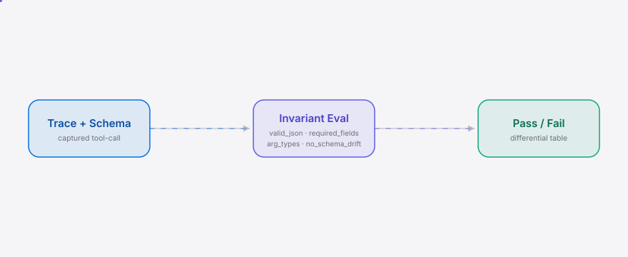

<div align="right"><sub><b>English</b>&nbsp;&nbsp;⇄&nbsp;&nbsp;<a href="./README.md">简体中文</a></sub></div>

<picture>
  <source media="(prefers-color-scheme: dark)" srcset="./assets/hero-dark.svg">
  <source media="(prefers-color-scheme: light)" srcset="./assets/hero-light.svg">
  
</picture>

<p align="center"><sub>Invary is the differential tester that flags which CN model silently breaks a tool-call contract.</sub></p>

<p align="center">
  <a href="./LICENSE"></a>
  &nbsp;
  &nbsp;
  &nbsp;
</p>

**Turn a blind model swap into a measured decision — run one prompt + tool schema across four CN models and see who silently breaks.**

<h2> Architecture</h2>

<picture>
  <source media="(prefers-color-scheme: dark)" srcset="./assets/atlas-dark.svg">
  <source media="(prefers-color-scheme: light)" srcset="./assets/atlas-light.svg">
  
</picture>

One captured tool-call trace + one tool schema flow into the invariant evaluator (`valid_json` / `required_fields` / `arg_types` / `no_schema_drift`), which emits per-invariant pass/fail with the minimal failing evidence. m1 isolates this primitive from any network call — feed it a saved trace.

## Contents

- [Why Invary](#why-invary)
- [Install & Quickstart](#install--quickstart)
- [Usage](#usage)
- [Demo](#demo)
- [Configuration](#configuration)
- [Roadmap](#roadmap)
- [FAQ](#faq)
- [License & Contributing](#license--contributing)

<h2> Why Invary</h2>

Swapping a coding agent between DeepSeek, Qwen, Kimi and GLM today is done blind: each model emits tool-call JSON in a subtly different shape, honors JSON mode differently, and nothing runs **the same prompt + tool schema** across the four and reports which model silently violates a contract the others keep. After a blind swap the tool-call JSON that was valid on model A silently breaks on model B (extra quoting, a renamed `arguments`, wrapped vs. raw JSON), and the agent either crashes or invokes a tool with the wrong arguments. Invary is the differential oracle — **your own invariant set is the ground truth; no learned oracle required**.

<h2> Install & Quickstart</h2>

Single binary, no runtime, no account. m1's `invary check` evaluates saved traces only — **no API key required**.

```bash
git clone https://github.com/SuperMarioYL/invary && cd invary
go run . check --trace examples/sample_kimi_output.json --schema examples/tool-schema.json
```

<details><summary>Sample output</summary>

```
trace:   examples/sample_kimi_output.json
schema:  examples/tool-schema.json
tool:    get_weather
args:    {'location': 'Tokyo', 'unit': 'celsius'}

INVARIANT        SEV      STATE  EVIDENCE
valid_json       error    ✗ FAIL  arguments is not valid JSON: invalid character '\'' looking for beginning of object key string
required_fields  error    ✗ FAIL  arguments is not valid JSON (see valid_json)
arg_types        error    ✗ FAIL  arguments is not valid JSON (see valid_json)
no_schema_drift  warn     ✗ FAIL  arguments is not valid JSON (see valid_json)

0 pass / 4 fail
```

Swap to `examples/sample_deepseek_output.json` and all four pass; swap to `examples/sample_glm_output.json` and only `no_schema_drift` fails (an extra `timezone` field the schema does not declare).
</details>

To install globally: `go install .` (then use `invary check ...` directly).

<h2> Usage</h2>

`invary check` is the m1 entry point: read one captured tool-call trace + one tool schema, run the four built-in invariants, and print per-invariant pass/fail with the minimal failing evidence. The trace may be a full chat-completions response, an assistant message with `tool_calls`, a bare `tool_call` object, or a minimal `{"arguments":...}` object.

```bash
# A silent break: arguments is not valid JSON (single-quoted pseudo-JSON)
invary check --trace examples/sample_kimi_output.json --schema examples/tool-schema.json

# A fully conforming trace: all four pass
invary check --trace examples/sample_deepseek_output.json --schema examples/tool-schema.json

# Schema drift: an extra field the schema does not declare
invary check --trace examples/sample_glm_output.json --schema examples/tool-schema.json
```

Exit code is non-zero on any invariant failure, so `invary check` can gate a pipeline. `severity` signals how to triage (`error` hard, `warn` drift); the exit code only reflects "did every invariant pass".

> The other subcommands are skeletons for later milestones: `invary run` (m2, live differential across the four providers) and `invary init` (m3, writes `invariants.yaml` + copies the example schema) return a "not available" notice in this build.

<h2> Demo</h2>


The 10-minute happy path: `git clone` → `go run . check` → see the differential evidence. `docs/demo.tape` is a replayable [vhs](https://github.com/charmbracelet/vhs) script; `.github/workflows/demo.yml` re-renders `assets/demo.gif` on demand.

<h2> Configuration</h2>

m1 needs no config file — `invary check` always runs the four built-in invariants, the schema comes via `--schema` and the trace via `--trace`.

These environment variables are needed by `invary run` (m2) for the live differential run; m1 does not use them:

| Variable | Meaning |
|---|---|
| `DEEPSEEK_API_KEY` | DeepSeek API key |
| `QWEN_API_KEY` | Qwen (DashScope) API key |
| `KIMI_API_KEY` | Kimi (Moonshot) API key |
| `GLM_API_KEY` | GLM (Zhipu) API key |

The four providers' OpenAI-compatible base URLs and default model ids are built-in defaults in `internal/model/provider.go` — no config needed. A custom invariant set (`invariants.yaml`) is scaffolded by m3's `invary init`; the DSL shape is documented in `examples/invariants.yaml`.

<h2> Roadmap</h2>

- [x] **m1** invariant DSL + 4 contract checks (`valid_json` / `required_fields` / `arg_types` / `no_schema_drift`) + single-trace evaluator, demonstrable via `invary check`
- [ ] **m2** four-provider OpenAI-compatible client + diff runner + differential table with silent-breaker flags, demonstrable via `invary run`
- [ ] **m3** `invary init` writes `invariants.yaml` + copies example schema + README hero differential table + VHS demo GIF + goreleaser + Gitee mirror
- [ ] Future: generative PBT (random schema fuzzing to *find* the break, not just check) / single-model version regression / CI wrapper packaging

<h2> FAQ</h2>

**Isn't this just promptfoo with a different name?** No. promptfoo compares answer *quality*; Invary compares tool-call *contract conformance* (valid JSON / arg types / schema drift) — a different axis a quality-eval tool has no incentive to specialize in. The `silent-breaker` flag (passes on 3, fails on 1) is unique to the differential frame.

**Why not just run my own 4 curl calls?** You get 4 outputs. Invary's value is the invariant evaluator + silent-breaker detection — bisecting which of 4 models broke which invariant by hand is the chore this removes.

**Won't the providers just converge on OpenAI's tool-calling spec and kill this?** Our top risk. If they do, Invary pivots to single-model *version-bump regression* (does your provider keep the contract across releases), which survives harmonization.

**Why only CN models?** Because the per-model tool-call JSON quirks of the CN set are the specific surface no global eval tool specializes in. GPT/Claude is a v0.2 non-goal.

<h2> License & Contributing</h2>

MIT — see [LICENSE](./LICENSE). Found a problem or want to contribute? Open an [issue](https://github.com/SuperMarioYL/invary/issues) or PR. `go test ./...` guards the invariant evaluator.

<p align="center"><sub><a href="./LICENSE">MIT</a> © 2026 SuperMarioYL</sub></p>
