[English](./README.en.md) · [Website](https://invary.lei6393.com) · [GitHub](https://github.com/SuperMarioYL/invary)

<picture>
  <source media="(max-width: 600px) and (prefers-color-scheme: dark)" srcset="./assets/presentation/hero-mobile-dark.svg">
  <source media="(max-width: 600px)" srcset="./assets/presentation/hero-mobile-light.svg">
  <source media="(prefers-color-scheme: dark)" srcset="./assets/presentation/hero-dark.svg">
  
</picture>

# invary

**从保存的响应中找出工具调用违约。**

Invary 在本地按四项明确不变量检查捕获的工具调用，并输出失败证据。

## 为什么需要它

响应看似合理，也可能缺少必填参数、类型错误或多出字段。保存响应与工具 schema 后，无需再次请求模型即可复现这些问题。

- **离线复现** — 保存的轨迹与 schema 即可运行。
- **具体失败证据** — 每个不变量指出违反的契约。
- **可脚本化门禁** — 失败检查返回非零状态。

## 架构

<picture>
  <source media="(max-width: 600px) and (prefers-color-scheme: dark)" srcset="./assets/presentation/architecture-mobile-dark.svg">
  <source media="(max-width: 600px)" srcset="./assets/presentation/architecture-mobile-light.svg">
  <source media="(prefers-color-scheme: dark)" srcset="./assets/presentation/architecture-dark.svg">
  
</picture>

CLI 加载轨迹与 schema JSON，选择第一个工具调用，检查 valid_json、required_fields、arg_types 和 no_schema_drift。报告逐规则输出证据；任一失败都会非零退出，包括警告级的字段漂移。

| 组件 | 职责 |
| --- | --- |
| `Trace + schema` | cmd/check.go |
| `Schema parser` | internal/invariant |
| `Four invariants` | internal/invariant/checks.go |
| `Evidence table` | CLI stdout and exit code |

## 安装与快速上手

使用仓库清单指定的运行时版本构建，并在仓库根目录运行示例。

```bash
git clone https://github.com/SuperMarioYL/invary.git
cd invary
go build .
```

脚本检查两份完整随仓合成轨迹，并核验预期的成功与拒绝退出码。

```bash
python3 examples/presentation-demo.py
```

## 实际运行示例

<picture>
  <source media="(max-width: 600px) and (prefers-color-scheme: dark)" srcset="./assets/presentation/process-mobile-dark.svg">
  <source media="(max-width: 600px)" srcset="./assets/presentation/process-mobile-light.svg">
  <source media="(prefers-color-scheme: dark)" srcset="./assets/presentation/process-dark.svg">
  
</picture>

One fixture passes all four checks; the other fails no_schema_drift on the extra timezone field.

```text
trace:   examples/sample_deepseek_output.json
schema:  examples/tool-schema.json
tool:    get_weather
args:    {"location":"Tokyo","unit":"celsius"}

INVARIANT        SEV      STATE  EVIDENCE
valid_json       error    ✓ pass -
required_fields  error    ✓ pass -
arg_types        error    ✓ pass -
no_schema_drift  warn     ✓ pass -

4 pass / 0 fail
command exit: 0
trace:   examples/sample_glm_output.json
schema:  examples/tool-schema.json
tool:    get_weather
args:    {"location":"Tokyo","timezone":"Asia/Tokyo"}

INVARIANT        SEV      STATE  EVIDENCE
valid_json       error    ✓ pass -
required_fields  error    ✓ pass -
arg_types        error    ✓ pass -
no_schema_drift  warn     ✗ FAIL undeclared argument field(s): timezone

3 pass / 1 fail
command exit: 1
```

完整命令与输出保存在 [docs/demo-results.json](./docs/demo-results.json). 输入和复现代码均随仓提供。


保留已有录制供参考；上方文字示例给出当前可复现的操作。

## 用法

CLI 提供以下操作。示例之外的命令需要替换成你的文件路径或标识。

```bash
go run . check --trace examples/sample_deepseek_output.json --schema examples/tool-schema.json
go run . check --trace examples/sample_glm_output.json --schema examples/tool-schema.json
go run . init
```

`invary init` 在当前目录写出 `invariants.yaml` 与 `tool-schema.json` 起始文件（与 `examples/` 同源），已有同名文件时直接拒绝，不做任何覆盖。

## 配置

check 必须提供 --trace 和 --schema。四条规则内置，无需 API 密钥或配置文件。warn 级别用于分诊，不会让失败规则通过门禁。

`invary init`（v0.2.0 起）落盘的 `invariants.yaml` 记录不变量 DSL 形状，供自定义契约集参考；`check` 本身不读取该文件。

## 集成与职责分工

<picture>
  <source media="(max-width: 600px) and (prefers-color-scheme: dark)" srcset="./assets/presentation/integrations-mobile-dark.svg">
  <source media="(max-width: 600px)" srcset="./assets/presentation/integrations-mobile-light.svg">
  <source media="(prefers-color-scheme: dark)" srcset="./assets/presentation/integrations-dark.svg">
  
</picture>

以下路径已有源码实现。按任务选择输入，并把生成的结果与项目一起保存。

| 路径 | 已实现职责 |
| --- | --- |
| Captured JSON | Full response or tool-call object |
| Tool schema | Declared properties and required fields |
| Terminal report | Rule verdicts and evidence |
| Exit status | Pipeline failure signal |

## 限制与后续方向

- check 只检查响应中的第一个工具调用，不是完整 JSON Schema 实现。
- run 仍为里程碑占位，当前版本不执行在线多提供方差分运行；init（v0.2.0 起）已在本地可用。
- fixture 中的提供方名称只是文件标签，不代表实测可靠性。

实时多提供方比较和可配置不变量加载属于后续里程碑，当前实现的是保存响应检查。

## 许可与贡献

许可见 [LICENSE](./LICENSE). 反馈问题时请提供最小输入、执行命令和实际输出。
