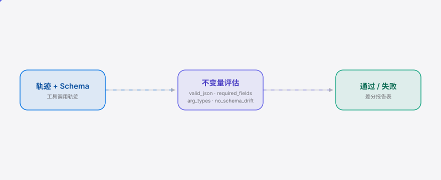

<div align="right"><sub><a href="./README.en.md">English</a>&nbsp;&nbsp;⇄&nbsp;&nbsp;<b>简体中文</b></sub></div>

<picture>
  <source media="(prefers-color-scheme: dark)" srcset="./assets/hero-cn-dark.svg">
  <source media="(prefers-color-scheme: light)" srcset="./assets/hero-cn-light.svg">
  
</picture>

<p align="center"><sub>Invary 是标记哪个国产模型静默违反工具调用契约的差分测试器。</sub></p>

<p align="center">
  <a href="./LICENSE"></a>
  &nbsp;
  &nbsp;
  &nbsp;
</p>

**把模型替换从盲赌变成可度量的决策——同一个 prompt + 工具 schema 跑过四个国产模型，立刻看到谁静默违约。**

<h2> 架构</h2>

<picture>
  <source media="(prefers-color-scheme: dark)" srcset="./assets/atlas-cn-dark.svg">
  <source media="(prefers-color-scheme: light)" srcset="./assets/atlas-cn-light.svg">
  
</picture>

一份捕获的工具调用轨迹 + 一份工具 schema，进入不变量评估器（`valid_json` / `required_fields` / `arg_types` / `no_schema_drift`），输出逐条通过/失败的最小证据。m1 把这个原语和任何网络调用隔离开——喂一份保存好的轨迹即可。

## 目录

- [为什么需要 Invary](#为什么需要-invary)
- [安装与快速开始](#安装与快速开始)
- [用法](#用法)
- [演示](#演示)
- [配置](#配置)
- [路线图](#路线图)
- [常见问题](#常见问题)
- [协议与贡献](#协议与贡献)

<h2> 为什么需要 Invary</h2>

在 DeepSeek / Qwen / Kimi / GLM 之间切换编码智能体的模型，今天全靠盲赌：每个模型吐出的工具调用 JSON 形态各异，遵守 JSON 模式的方式不同，而没有任何工具拿**同一个 prompt + 工具 schema** 跑过这四家、报告哪个模型静默违反了其他模型都遵守的契约。一次盲切之后，工具调用 JSON 在 A 模型上合法、在 B 模型上静默崩掉（多余引号、`arguments` 重命名、包装成字符串），智能体要么崩溃，要么用错的参数去调工具。Invary 就是这个差分预言机——**你自己指定的不变量集就是 ground truth，不需要任何学习型预言机**。

<h2> 安装与快速开始</h2>

单二进制，无运行时，无需账号。m1 的 `invary check` 只评估保存好的轨迹，**不需要任何 API key**。

```bash
git clone https://github.com/SuperMarioYL/invary && cd invary
go run . check --trace examples/sample_kimi_output.json --schema examples/tool-schema.json
```

<details><summary>样例输出</summary>

```
trace:   examples/sample_kimi_output.json
schema:  examples/tool-schema.json
tool:    get_weather
args:    {'location': 'Tokyo', 'unit': 'celsius'}

INVARIANT        SEV      STATE  EVIDENCE
valid_json       error    ✗ FAIL  arguments is not valid JSON: invalid character '\'' looking for beginning of object key string
required_fields  error    ✗ FAIL  arguments is not valid JSON (see valid_json)
arg_types        error    ✗ FAIL  arguments is not valid JSON (see valid_json)
no_schema_drift  warn     ✗ FAIL  arguments is not valid JSON (see valid_json)

0 pass / 4 fail
```

换成 `examples/sample_deepseek_output.json` 则四条全过；换成 `examples/sample_glm_output.json` 则只有 `no_schema_drift` 失败（多了一个 schema 没声明的 `timezone` 字段）。
</details>

想全局安装：`go install .`（之后 `invary check ...` 直接用）。

<h2> 用法</h2>

`invary check` 是 m1 的入口：读一份捕获的工具调用轨迹 + 一份工具 schema，跑四个内建不变量，打印逐条通过/失败与最小失败证据。轨迹可以是完整的 chat-completions 响应、带 `tool_calls` 的 assistant 消息、裸 `tool_call` 对象，或最小 `{"arguments":...}` 对象。

```bash
# 一个静默违约的轨迹：arguments 不是合法 JSON（单引号伪 JSON）
invary check --trace examples/sample_kimi_output.json --schema examples/tool-schema.json

# 一个完全合规的轨迹：四条全过
invary check --trace examples/sample_deepseek_output.json --schema examples/tool-schema.json

# schema 漂移：多了一个 schema 没声明的字段
invary check --trace examples/sample_glm_output.json --schema examples/tool-schema.json
```

退出码：任何一条不变量失败即非零，因此 `invary check` 可作为流水线闸门。`severity` 标注如何分诊（`error` 硬违约、`warn` 偏移），退出码只反映「是否全过」。

> 其他子命令是后续里程碑的骨架：`invary run`（m2，四供应商实时差分）与 `invary init`（m3，写出 `invariants.yaml` + 拷贝示例 schema）在本构建中会返回「未实现」提示。

<h2> 演示</h2>


10 分钟内的快乐路径：`git clone` → `go run . check` → 看到差分证据。`docs/demo.tape` 是可重放的 [vhs](https://github.com/charmbracelet/vhs) 脚本，`.github/workflows/demo.yml` 按需重渲染 `assets/demo.gif`。

<h2> 配置</h2>

m1 无需任何配置文件——`invary check` 始终跑四个内建不变量，schema 通过 `--schema` 传入，轨迹通过 `--trace` 传入。

下面这些环境变量是 `invary run`（m2）实时差分运行所需，m1 用不到：

| 变量 | 说明 |
|---|---|
| `DEEPSEEK_API_KEY` | DeepSeek API key |
| `QWEN_API_KEY` | 通义千问 API key |
| `KIMI_API_KEY` | Kimi（Moonshot）API key |
| `GLM_API_KEY` | GLM（智谱）API key |

四家供应商的 OpenAI 兼容 base URL 与默认 model id 是 `internal/model/provider.go` 里的内建默认值，无需配置。自定义不变量集（`invariants.yaml`）由 m3 的 `invary init` 落盘，DSL 形状见 `examples/invariants.yaml`。

<h2> 路线图</h2>

- [x] **m1** 不变量 DSL + 4 个契约检查（`valid_json` / `required_fields` / `arg_types` / `no_schema_drift`）+ 单轨迹评估器，`invary check` 可演示
- [ ] **m2** 四供应商 OpenAI 兼容客户端 + 差分运行器 + 差分表与静默违约标记，`invary run` 可演示
- [ ] **m3** `invary init` 写 `invariants.yaml` + 拷贝示例 schema + README hero 差分表 + VHS demo GIF + goreleaser + Gitee 镜像
- [ ] 未来：生成式 PBT（随机 schema 模糊来「发现」违约而非仅检查）/ 单模型版本回归 / CI 包装

<h2> 常见问题</h2>

**这不就是 promptfoo 换个名字吗？** 不是。promptfoo 比**答案质量**；Invary 比**工具调用契约一致性**（合法 JSON / 参数类型 / schema 漂移）——一个质量评估工具没动力专精的轴。`silent-breaker` 标记（3 家过、1 家挂）是差分框架独有的。

**我自己跑 4 个 curl 不就行了？** 你会拿到 4 份输出。Invary 的价值是不变量评估器 + 静默违约检测——手工逐模型逐契约二分哪个违约，正是本工具消除的杂活。

**供应商都收敛到 OpenAI 的工具调用规范，这工具不就废了？** 这是我们头号风险。若真收敛，Invary 会转向单模型**版本回归**（你的供应商跨版本是否守约），那样仍活下来。

**为什么只覆盖国产模型？** 因为国产模型的逐家工具调用 JSON 怪癖是全球评估工具没动力专精的特定表面。GPT/Claude 是 v0.2 的非目标。

<h2> 协议与贡献</h2>

MIT，见 [LICENSE](./LICENSE)。发现问题或想贡献？欢迎提 [issue](https://github.com/SuperMarioYL/invary/issues) 或 PR。`go test ./...` 守护不变量评估器。

<p align="center"><sub><a href="./LICENSE">MIT</a> © 2026 SuperMarioYL</sub></p>
